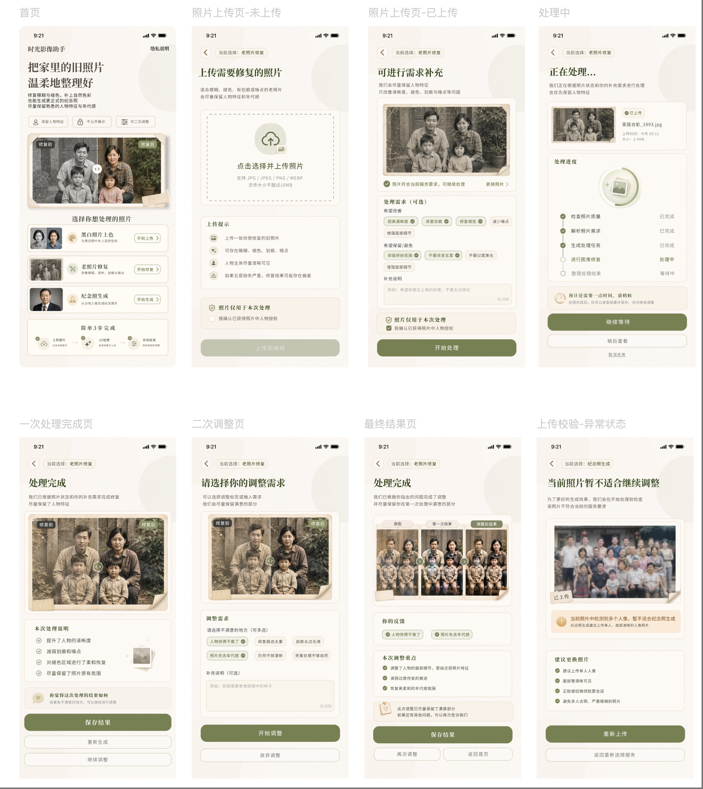

# AI 家庭纪念影像助手

微信小程序 MVP，面向家庭影像修复场景，覆盖任务提交、AI 需求转译、结果确认与二次调整流程。

小程序使用微信云开发保存任务与图片，通过 Dify Workflow 生成处理任务卡和图像 Prompt；图像结果为 mock 示例图，后续可替换为真实图像处理 API。

## 功能

- 小程序端完整主流程：服务选择、上传、处理中、结果、二次调整、保存
- 云存储保存用户上传原图
- 云数据库记录任务和调整请求
- Dify 初次 Workflow：生成 `taskCard` 和 `generatedPrompt`
- Dify 二次调整 Workflow：生成 `adjustmentTaskCard` 和 `secondRoundPrompt`
- mock 图像结果闭环，预留真实图像 API 接入位置

## 技术栈

- 微信小程序原生开发
- 微信云开发：云函数、云数据库、云存储
- Dify Workflow
- Streamlit / Python：早期流程原型

## 截图



## 架构

```text
miniprogram
  -> CloudBase Storage / Database / Functions
  -> Dify Workflow
  -> mock image results
```

主要云函数：

```text
createTask
saveTaskResult
runDifyPlan
runDifyAdjustment
```

## 运行

### 小程序

使用微信开发者工具打开 `miniprogram/`，并配置正式小程序 AppID、微信云开发环境和以下云函数：

```text
createTask
saveTaskResult
runDifyPlan
runDifyAdjustment
```

Dify 相关云函数需要配置环境变量：

```text
DIFY_API_KEY
DIFY_WORKFLOW_URL
DIFY_ADJUSTMENT_API_KEY
DIFY_ADJUSTMENT_WORKFLOW_URL
```

### Streamlit 原型

```bash
pip install -r requirements.txt
streamlit run app.py
```
 
## 边界

- 真实图像处理 API 为后续扩展项
- 支付、订单、后台管理不在当前范围
- 图像结果为 mock 示例图
- Workflow 输出用于任务规划和后续图像处理指令生成

## 文档

- [微信小程序云开发 MVP 说明](./docs/MINIPROGRAM_CLOUD_MVP.md)
- [AI Workflow 设计](./docs/AI_WORKFLOW_DESIGN.md)
- [项目总结](./docs/PROJECT_SUMMARY.md)

## 安全

- API Key 只配置在本地 secrets 或云函数环境变量中
- 不提交真实用户照片
- 不提交小程序私有配置和 AppSecret
