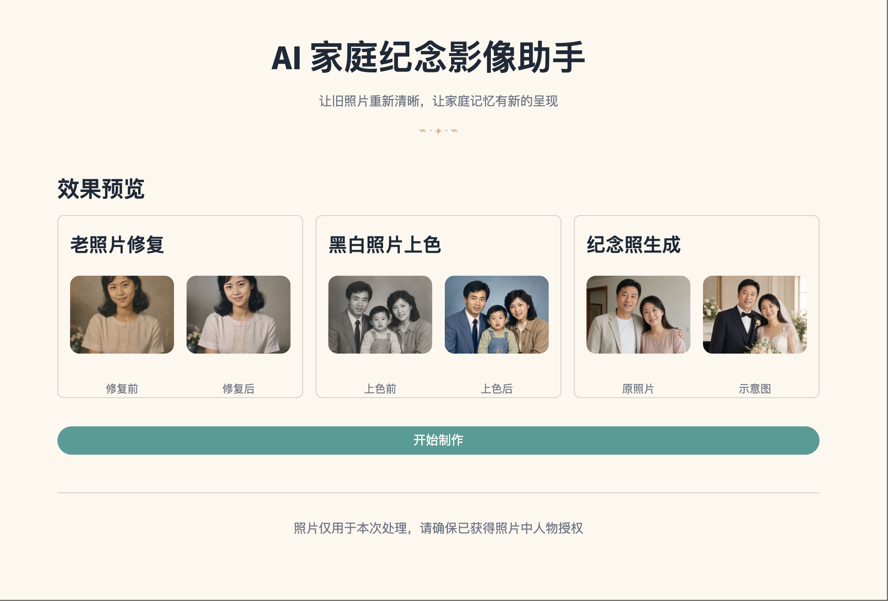
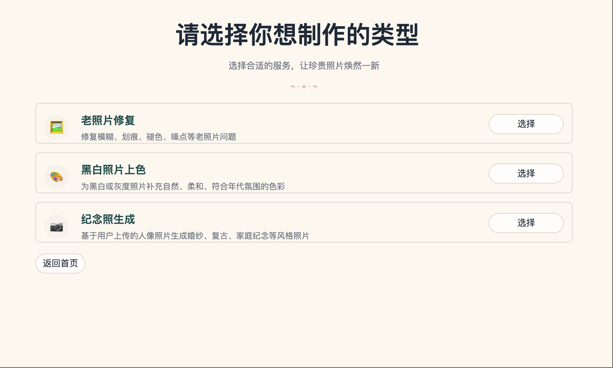
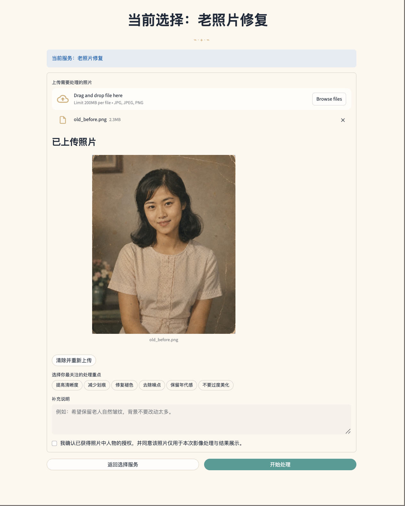
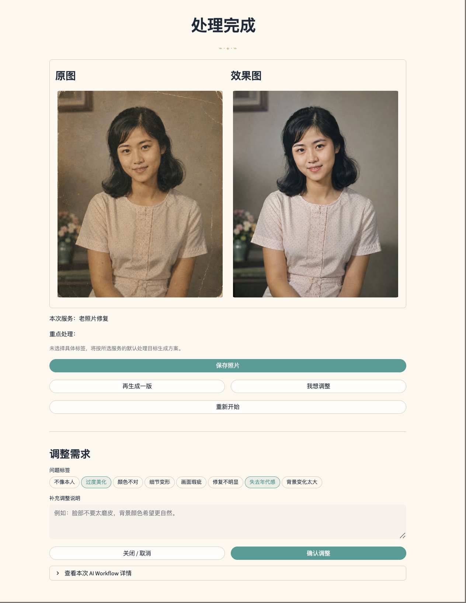
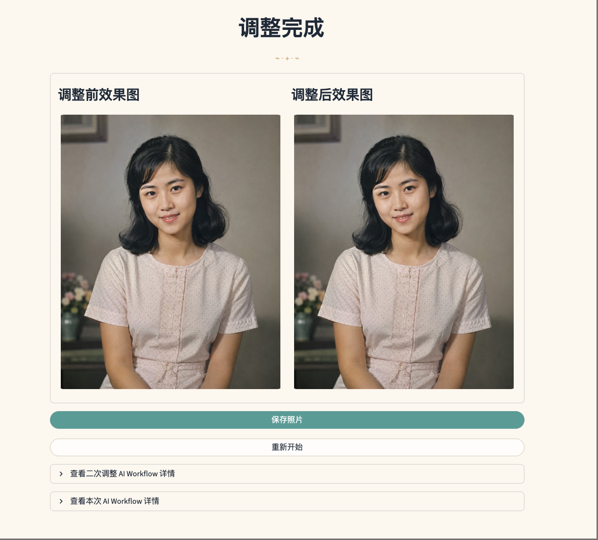
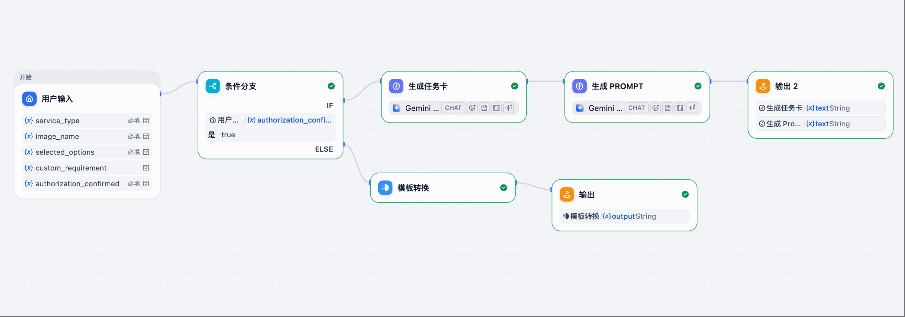
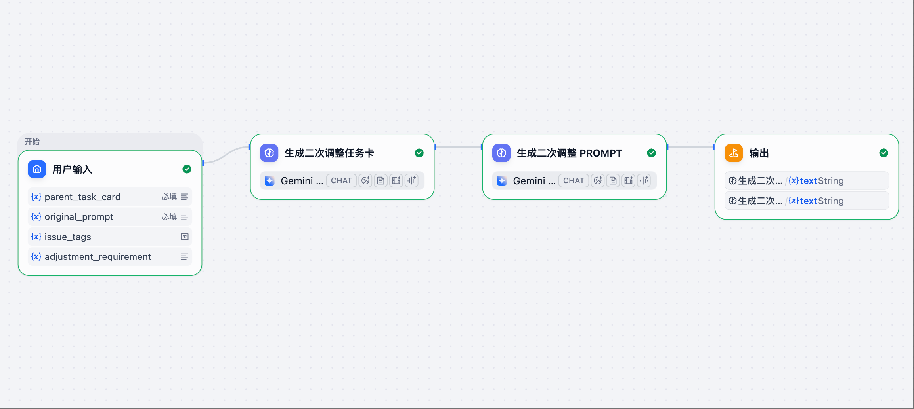

# AI 家庭纪念影像助手 MVP

## 项目简介

《AI 家庭纪念影像助手｜老照片修复与纪念照生成 MVP》是一个面向家庭纪念影像场景的 v0.1 可运行 Demo，用于验证从用户需求收集到 AI Workflow 编排、半自动图像处理回传、结果展示与二次调整的完整产品闭环。

项目围绕老照片修复、黑白照片上色、纪念照生成三类高频纪念影像需求展开。用户在前端选择服务、上传照片并补充处理偏好后，系统调用 Dify Workflow 生成结构化任务卡与图像处理 Prompt；操作员再基于这些指令使用外部图像工具完成人工 / 半自动处理，并将结果图上传回 Demo 进行展示。若用户对结果不满意，还可以在结果页提交问题标签或补充说明，触发二次调整 Workflow，形成“用户输入 -> AI Workflow 生成任务卡与 Prompt -> 半自动图像处理 -> 结果展示 -> 二次调整”的闭环。

当前版本已完成本地主流程验证，适合作为开发阶段 Demo 和产品方案验证基础，不代表正式生产环境版本。

## v0.1 当前范围

当前 v0.1 已覆盖：

- 老照片修复、黑白照片上色、纪念照生成三类服务选择
- 原始照片上传、需求标签选择、补充说明与授权确认
- 初次处理 Dify Workflow 调用
- 初次任务卡与图像处理 Prompt 生成
- 半自动上传初次处理后的效果图
- 结果页原图 / 效果图对比展示
- 二次调整需求收集
- 二次调整 Dify Workflow 调用
- 二次调整任务卡与二次 Prompt 生成
- 半自动上传二次调整后的效果图
- 调整完成页对比展示
- AI Workflow 详情折叠区，用于内部演示、调试和半自动处理

当前 v0.1 未接入真实图像处理 API，不会自动完成图像生成；图像处理结果需要由操作员使用外部图像工具人工 / 半自动处理后回传。当前版本也不包含登录、支付、订单、历史任务、复杂后台、多轮无限调整或正式移动端产品交互。

当前 v0.1 已完成本地主流程回归测试，覆盖服务选择、照片上传、AI Workflow 调用、结果展示与二次调整等关键路径。

## 技术架构

### Streamlit 前端

Streamlit 负责承载可演示产品界面，包括服务选择、图片上传、需求输入、结果展示、二次调整入口和 Workflow 详情折叠区。当前 Demo 主要用于验证核心流程，不等同于正式生产环境产品。

### Dify Workflow 编排

Dify Workflow 负责任务理解和处理方案生成：

- 初次处理 Workflow：根据服务类型、图片名、用户标签和补充说明生成任务卡与图像处理 Prompt。
- 二次调整 Workflow：根据初次任务卡、初次 Prompt、问题标签和补充说明生成二次调整任务卡与二次 Prompt。

### 半自动图像处理结果回传

v0.1 暂不接真实图像处理 API。图像处理阶段由操作员根据 Workflow 生成的处理指令，在外部图像工具中完成人工 / 半自动处理，再将效果图上传回 Streamlit Demo 继续展示。

Workflow 详情、Prompt 和 raw response 主要用于内部演示、调试和半自动处理，不作为普通用户主界面内容。

## 页面流程

1. 首页
   - 展示产品定位、效果预览和开始制作入口。

2. 服务选择页
   - 选择老照片修复、黑白照片上色或纪念照生成。

3. 上传照片与需求补充页
   - 未上传状态：展示上传入口和适用提示。
   - 已上传状态：展示原图预览、需求标签、补充说明和授权确认。

4. 生成 AI 处理方案
   - 调用初次处理 Dify Workflow。

5. AI 已理解你的需求 / 上传效果图页
   - 展示普通用户可理解的需求摘要。
   - 操作员可通过折叠区查看任务卡、Prompt 和 raw response。
   - 上传初次处理后的效果图。

6. 结果展示页
   - 展示原图 / 效果图对比。
   - 支持保存照片、再生成一版、我想调整、重新开始。

7. 二次调整区域
   - 收集问题标签和补充调整说明。
   - 调用二次调整 Dify Workflow。
   - 展示二次调整方案已生成，并上传二次调整后的效果图。

8. 调整完成页
   - 展示调整前效果图 / 调整后效果图对比。
   - 支持保存照片和重新开始。

## 页面截图

以下截图使用 AI 生成测试图片与本地 Demo 页面，不包含真实用户隐私照片。

### 首页 / 产品介绍



### 服务选择



### 上传照片与需求补充



### 结果展示与二次调整



### 调整完成



### Dify Workflow 配置示意 1



### Dify Workflow 配置示意 2



## Dify Workflow 说明

### 初次处理 Workflow

输入字段：

```json
{
  "service_type": "old_photo_restoration",
  "image_name": "example.png",
  "selected_options": "提高清晰度，减少划痕",
  "custom_requirement": "希望保留年代感",
  "authorization_confirmed": "true"
}
```

字段说明：

- `selected_options`：字符串，由前端选中的标签使用中文逗号拼接；未选择时可为空字符串。
- `authorization_confirmed`：传给 Dify 前会从前端布尔值转换为字符串 `"true"` 或 `"false"`。

输出字段：

```json
{
  "task_card": "初次处理任务卡",
  "generated_prompt": "初次图像处理 Prompt"
}
```

### 二次调整 Workflow

输入字段：

```json
{
  "parent_task_card": "初次处理任务卡",
  "original_prompt": "初次图像处理 Prompt",
  "issue_tags": "过度美化，失去年代感",
  "adjustment_requirement": "希望肤色更自然"
}
```

字段说明：

- `issue_tags`：字符串，由前端选中的问题标签使用中文逗号拼接；未选择时可为空字符串。
- `adjustment_requirement`：字符串，用户补充调整说明，可单独为空，但不能与 `issue_tags` 同时为空。

输出字段：

```json
{
  "adjustment_task_card": "二次调整任务卡",
  "second_round_prompt": "二次调整图像处理 Prompt"
}
```

## 本地运行方式

1. 进入项目目录：

   ```bash
   cd ai_memory_photo_mvp
   ```

2. 创建并激活虚拟环境：

   ```bash
   python3 -m venv .venv
   source .venv/bin/activate
   ```

3. 安装依赖：

   ```bash
   pip install -r requirements.txt
   ```

4. 配置 Streamlit secrets：

   ```bash
   cp .streamlit/secrets.toml.example .streamlit/secrets.toml
   ```

5. 启动 Streamlit：

   ```bash
   streamlit run app.py
   ```

## secrets.toml 配置说明

请在 `.streamlit/secrets.toml` 中配置以下字段。不要将真实 API Key 提交到 GitHub。

```toml
DIFY_API_KEY = "your-initial-workflow-api-key"
DIFY_WORKFLOW_URL = "https://api.dify.ai/v1/workflows/run"

DIFY_ADJUSTMENT_API_KEY = "your-adjustment-workflow-api-key"
DIFY_ADJUSTMENT_WORKFLOW_URL = "https://api.dify.ai/v1/workflows/run"
```

如果未配置 Workflow，Demo 可使用 Mock 结果预览页面流程。正式演示 AI 编排能力时，建议配置真实 Dify Workflow。

## v0.1 已知限制

- 当前 v0.1 未接入真实图像处理 API。
- 图像处理结果需要人工 / 半自动上传。
- Streamlit Demo 用于验证核心流程，不等同于正式生产环境产品。
- Workflow 详情、Prompt 和 raw response 主要用于内部演示、调试和半自动处理，不作为普通用户主界面内容。
- 暂不支持登录、支付、订单、历史任务。
- 暂不支持多轮无限调整。
- Streamlit 版本暂不作为正式移动端产品。

## 后续迭代方向

- 接入真实图像处理 API，完成从 Prompt 到图像结果的自动化闭环。
- 支持多轮调整和版本管理。
- 优化移动端体验。
- 增加结果质量评估机制。
- 完善产品说明、流程图、用户场景和演示素材。

## 安全说明

- `.streamlit/secrets.toml` 不应提交 GitHub。
- API Key 不应暴露在前端、README、测试报告或截图中。
- Demo 截图时应避免展示 Workflow 详情中的敏感信息。
- 用户上传照片仅用于本次处理和结果展示，应确保已获得照片中人物授权。
